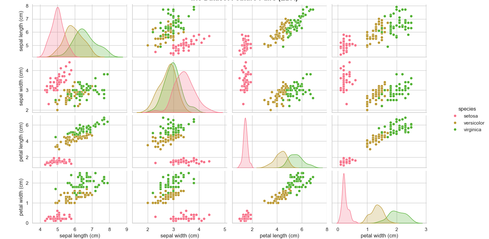

# 🌸 Flower Classification Project (Machine Learning)

**Internship Task 1 | Syntecxhub**

## 📖 Overview
This project is part of my Artificial Intelligence internship at **Syntecxhub**. It demonstrates the end-to-end Machine Learning lifecycle by classifying Iris flowers into three species (*Setosa, Versicolor, Virginica*) based on their physical measurements.

The solution includes:
* **Exploratory Data Analysis (EDA):** Visualizing feature relationships using Seaborn.
* **Model Comparison:** Evaluating Logistic Regression vs. Decision Tree classifiers.
* **Interactive CLI:** A real-time command-line interface for user predictions.

## 📊 Project Visuals
Below is the **Pair Plot** generated by the application, showing how different flower features correlate with each other. This step was crucial for understanding the data before training.



## 🛠️ Tech Stack
* **Language:** Python 3.x
* **Libraries:** `pandas`, `seaborn`, `matplotlib`, `scikit-learn`
* **Dataset:** Iris Dataset (Standard ML benchmark)

## ⚡ Features
1.  **Automated EDA:** Instantly generates and displays feature pair plots.
2.  **Model Training:** Trains multiple models and prints accuracy scores to the console.
3.  **Confusion Matrix:** Visualizes where the model made mistakes (if any).
4.  **Prediction System:** A built-in CLI allowing users to input custom values (Sepal/Petal dimensions) and get a predicted species.

## 🚀 How to Run locally

**1. Clone the repository**
```bash
git clone [https://github.com/shilwantfulari/Syntecxhub_Flower_Classification.git](https://github.com/shilwantfulari/Syntecxhub_Flower_Classification.git)
cd Syntecxhub_Flower_Classification
